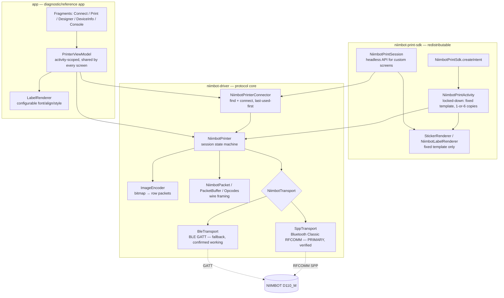
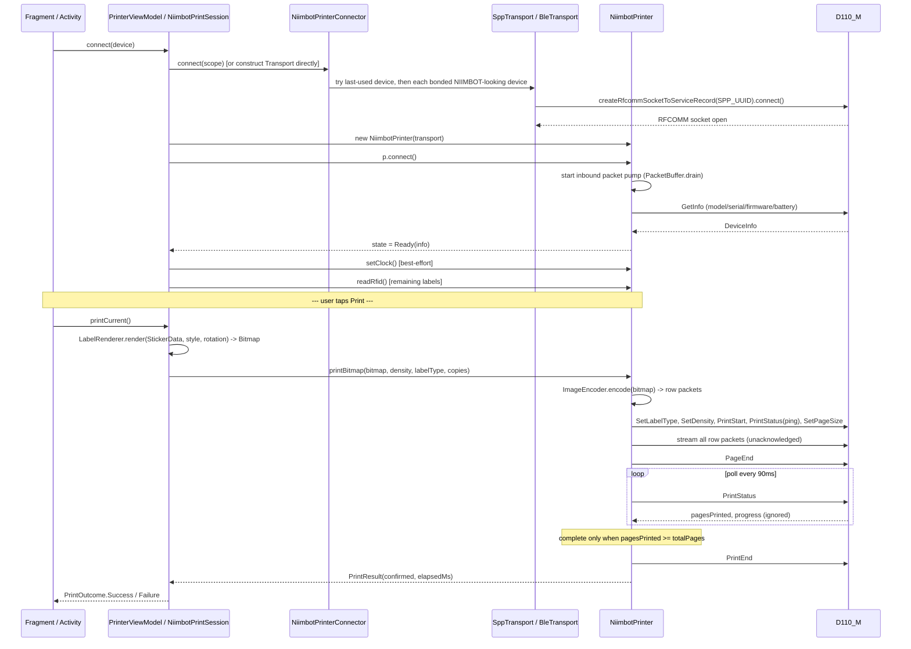
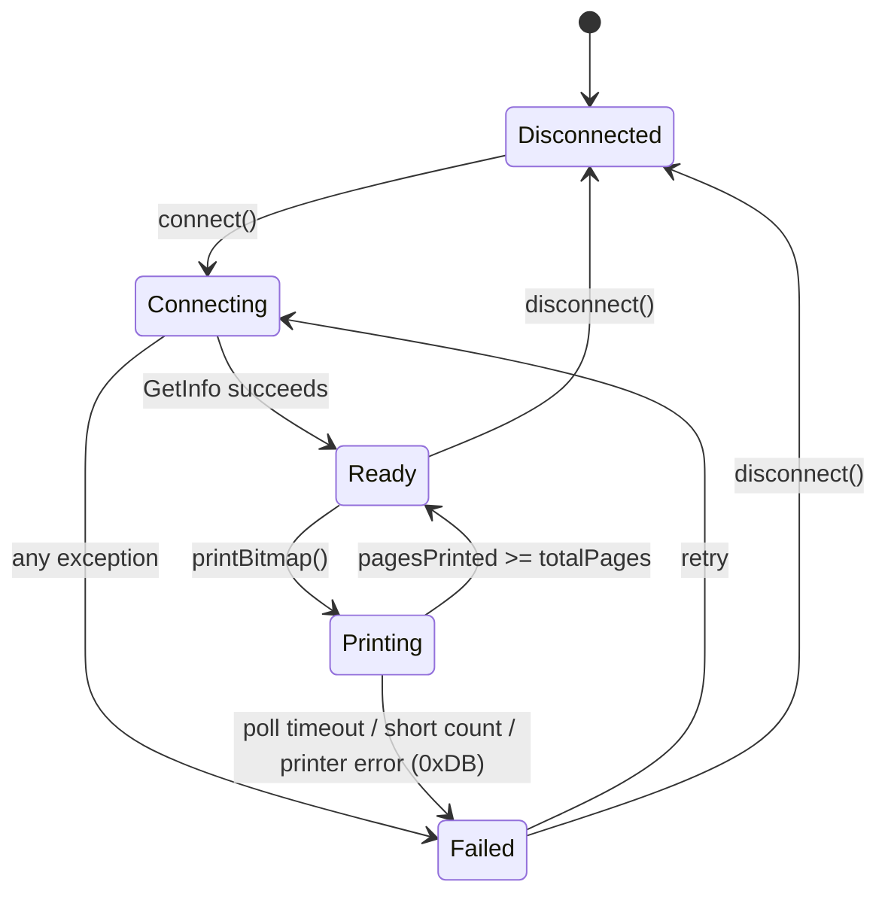

# NiimBRIDGE

**A reverse-engineered, hardware-validated Android driver + SDK + diagnostic app for the NIIMBOT D110_M thermal label printer.**

Built for **TreBle Respire** (a clinical research app) to print specimen/consent stickers (Study ID, EMIR ID, sticker type) directly from Android over Bluetooth — no vendor SDK, no cloud dependency, protocol verified byte-for-byte against the official NIIMBOT app.

> **Status: working, field-confirmed.** Both transports connect to a real D110_M and complete print jobs: **SPP (Bluetooth Classic)** is the protocol-verified primary path, and the **BLE fallback is also confirmed working in practice** (not just a theoretical fallback — see [Transports](#transports)). Real-world printing has been done with the **Serif** font selected in the Label Designer, overriding the code's default (Monospace) — see [Fonts in practice](#fonts-in-practice).

---

## Table of contents

1. [What this project is](#what-this-project-is)
2. [Repo / module map](#repo--module-map)
3. [Architecture](#architecture)
4. [The protocol (reverse-engineered, verified)](#the-protocol-reverse-engineered-verified)
5. [End-to-end flow: connect → render → print](#end-to-end-flow-connect--render--print)
6. [Transports](#transports)
7. [Fonts in practice](#fonts-in-practice)
8. [The app's screens](#the-apps-screens)
9. [Two ways to integrate this into another app](#two-ways-to-integrate-this-into-another-app)
10. [State machine](#state-machine)
11. [Key files reference](#key-files-reference)
12. [Build configuration](#build-configuration)
13. [Tests](#tests)
14. [Known caveats / do-not-touch invariants](#known-caveats--do-not-touch-invariants)

---

## What this project is

NIIMBOT sells no public protocol documentation for the D110_M. This project's `docs/PROTOCOL.md` was produced by capturing an **HCI snoop log** of the official NIIMBOT Android app printing two real jobs to a real D110_M (serial `I205020233`), decoding all 1,827 frames, and then re-implementing the encoder and re-testing it against the same capture:

> "The bitmaps recovered from the capture were re-encoded with the rules above and compared to the official app's packets: **194/194 and 201/201 packets, byte-identical**."

That verified protocol is implemented in a standalone Kotlin driver (`niimbot-driver`), wrapped in a redistributable SDK (`niimbot-print-sdk`), exercised by a full diagnostic app (`app`), and packaged for handoff as prebuilt `.aar`s (`sdk-release`).

---

## Repo / module map

```
NiimBridge/
├── app/                        Standalone diagnostic/reference Android app
│   └── src/main/java/com/muse/niimbridge/
│       ├── MainActivity.kt              Single-activity shell + bottom nav
│       ├── viewmodel/PrinterViewModel.kt  Activity-scoped state, shared by every screen
│       ├── bluetooth/                   DeviceScanner, BluetoothPermissions
│       ├── render/                      StickerData, LabelStyle, LabelRenderer
│       ├── logging/                     PacketLog, LogEntry (TX/RX/INFO ring buffer)
│       └── ui/
│           ├── connect/     ConnectFragment      – pair/scan/connect UI
│           ├── print/       PrintFragment        – density/copies/rotation + print buttons
│           ├── designer/    LabelDesignerFragment – live sticker editor + BitmapPreviewView
│           ├── deviceinfo/  DeviceInfoFragment   – firmware/serial/battery/RFID
│           └── console/     PacketConsoleFragment – raw hex TX + live packet log
│
├── niimbot-driver/             Pure protocol library — the actual reverse-engineered driver
│   └── src/main/java/com/muse/niimbot/
│       ├── NiimbotPacket.kt          Wire frame: build/parse/checksum
│       ├── PacketBuffer.kt           Fragmentation-safe frame accumulator
│       ├── Opcodes.kt                Every opcode + GetInfo key constant
│       ├── Models.kt                 DeviceInfo, RfidInfo, PrintStatus, PrintResult,
│       │                             PrinterState, NiimbotException
│       ├── ImageEncoder.kt           Bitmap → row packets (empty/indexed/bitmap)
│       ├── NiimbotTransport.kt       Transport interface
│       ├── SppTransport.kt           Bluetooth Classic RFCOMM (primary, verified)
│       ├── BleTransport.kt           BLE GATT transparent-serial (fallback)
│       ├── NiimbotPrinterConnector.kt  Device discovery + last-used-first fallback
│       └── NiimbotPrinter.kt         The session state machine — connect/print/poll
│
├── niimbot-print-sdk/           Redistributable SDK for host apps (e.g. TreBle Respire)
│   └── src/main/java/com/muse/niimbot/sdk/
│       ├── NiimbotPrintSdk.kt         Public entry point: createIntent(context, studyId, emirId)
│       ├── NiimbotPrintActivity.kt    (internal) the packaged, locked-down print screen
│       ├── NiimbotPrintViewModel.kt   (internal) its state
│       ├── StickerRenderer.kt         (internal) the one fixed template renderer
│       └── NiimbotLabelRenderer.kt / NiimbotPrintSession.kt  Public headless API for
│                                       host apps that want their own screen
│
├── sdk-release/                 Handoff artifacts for the consumer app team
│   ├── niimbot-driver-release.aar
│   ├── niimbot-print-sdk-release.aar
│   └── README.md                 Integration instructions for TreBle Respire
│
└── docs/
    ├── PROTOCOL.md                The verified protocol spec (HCI-capture derived)
    └── captured_label_job0_rot.png  Photo of an actual printed label from the capture
```

---

## Architecture



**Design principle running through the whole codebase:** the packaged SDK screen (`NiimbotPrintActivity`) and any custom host screen (via `NiimbotPrintSession`) call **the exact same `NiimbotPrinter` class** from `niimbot-driver`. There is no special, more-capable internal path — "everything a custom print screen needs" is public API. This is stated explicitly in the driver's own doc comments (`NiimbotPrinter.kt`):

> "the packaged NiimbotPrintSdk screen is built on exactly this same class; it has no special access you don't also have."

---

## The protocol (reverse-engineered, verified)

Full spec: [`docs/PROTOCOL.md`](docs/PROTOCOL.md). Summary:

### Transport
Bluetooth Classic **SPP over RFCOMM**, service UUID `00001101-0000-1000-8000-00805F9B34FB`. The capture contains **zero** ATT/GATT traffic — the official app never uses BLE on this model. The printer must already be **bonded** (paired in Android system Bluetooth settings) before connecting.

### Frame format
```
0x55 0x55 | type(u8) | len(u8) | data[len] | checksum(u8) | 0xAA 0xAA
checksum = type XOR len XOR data[0] XOR ... XOR data[len-1]
```
Frames arrive **fragmented** across RFCOMM/L2CAP reads — a receiver must accumulate and resynchronize on checksum failure (`PacketBuffer.kt` does exactly this).

### Opcode table

| TX | Name | RX | | TX | Name | RX |
|---|---|---|---|---|---|---|
| `0x01` | PrintStart | `0x02` | | `0x40` | GetInfo | `0x40+key` |
| `0x07` | SetRtcClock | `0x08` | | `0x83` | PrintBitmapRowIndexed | — |
| `0x13` | SetPageSize | `0x14` | | `0x84` | PrintEmptyRow | — |
| `0x1A` | GetRfid | `0x1B` | | `0x85` | PrintBitmapRow | — |
| `0x21` | SetDensity | `0x31` | | `0xA3` | PrintStatus | `0xB3` |
| `0x23` | SetLabelType | `0x33` | | `0xAF` | GetCapabilities | `0xBF` |
| | | | | `0xDC` | Heartbeat | `0xD9`/`0xDE` |
| | | | | `0xE3` | PageEnd | `0xE4` |
| | | | | `0xF3` | PrintEnd | `0xF4` |

Special inbound: `0xDB` = fatal printer error (abort). `0xD3` = unsolicited line-progress, must be logged and ignored, never matched to a pending request. `0x00` = command not supported, non-fatal.

### Print sequence (`D110M_V4`)
```
GetRfid → Heartbeat → SetLabelType → SetDensity → PrintStart → PrintStatus(ping)
→ SetPageSize → [row packets: PrintEmptyRow / PrintBitmapRowIndexed / PrintBitmapRow]
→ PageEnd → poll PrintStatus every ~90ms → PrintEnd
```

**`SetPageSize` carries `copies` — there is no separate quantity command.** Sending N copies is one hardware transaction, not N separate print calls (though the driver also supports calling `printBitmap` N times with `copies=1` for per-copy retry granularity — see `NiimbotPrinter.printBitmap` doc comment).

### The completion-detection trap (the single most important invariant in this codebase)

`PrintStatus` (`0xB3`) returns 8 bytes: `pagesPrinted(u16) progress1(u8) progress2(u8) telemetry(u16) 0x00 busy(u8)`. The progress bytes **lie**:

```
0000 64 64 2265 0001   <- pagesPrinted=0 but progress reads 100/100  (×7 consecutive polls!)
0000 00 00 2266 0001   <- progress resets and begins climbing again
0001 64 64 2326 0001   <- DONE: pagesPrinted == totalPages
```

**Rule enforced everywhere in this codebase:** completion is `pagesPrinted >= totalPages`, never the progress bytes. A poll timeout is always a **failure**, never an optimistic success. See `NiimbotPrinter.pollUntilComplete()` and `PrintResult.complete`.

---

## End-to-end flow: connect → render → print



### 1. Connect

`NiimbotPrinterConnector.connect()` ([`niimbot-driver/NiimbotPrinterConnector.kt`](niimbot-driver/src/main/java/com/muse/niimbot/NiimbotPrinterConnector.kt)) — bonded devices matching `"niimbot"` or `"d110"` (case-insensitive) in their name, last-successful device tried first, failures skipped rather than fatal:

```kotlin
suspend fun connect(scope: CoroutineScope): NiimbotTransport {
    val candidates = bondedCandidates()
    for (device in candidates) {
        val transport = SppTransport(adapter, device, scope)
        try {
            transport.connect()
            store.lastDeviceAddress = device.address
            return transport
        } catch (e: Exception) { /* try next candidate */ }
    }
    throw NiimbotException("No paired NIIMBOT printer could be reached...")
}
```

The standalone `app` module instead lets the user pick a `TransportKind` (SPP or BLE) explicitly in the Connect screen and constructs the transport directly in `PrinterViewModel.connect()`.

### 2. Handshake

`NiimbotPrinter.connect()` starts the inbound packet pump, then reads device info via `GetInfo` (0x40) to confirm the model and log firmware version — "the likeliest source of future breakage" per the code's own comments. State goes `Connecting → Ready(info)` or `Failed`.

### 3. Render

`LabelRenderer.render(data, style, rotationDegrees)` ([`app/render/LabelRenderer.kt`](app/src/main/java/com/muse/niimbridge/render/LabelRenderer.kt)) draws onto a fixed **320×96px** canvas (rotated — default 90°, the only orientation confirmed against real hardware) three lines of text: `studyId/`, `emirId`, `studyName`. Font, size (22px), alignment, bold/italic/underline all come from `LabelStyle`; anti-aliasing is deliberately **off** because the printer is a 1-bit thermal head — smoothed edges just become mud.

### 4. Encode

`ImageEncoder.encode(bitmap)` ([`niimbot-driver/ImageEncoder.kt`](niimbot-driver/src/main/java/com/muse/niimbot/ImageEncoder.kt)) converts each row to one of three packet types, with run-length compression across identical consecutive rows:

- **`PrintEmptyRow` (0x84)** — blank row, just `rowIndex + count`
- **`PrintBitmapRowIndexed` (0x83)** — fewer than 6 black pixels: send X-positions
- **`PrintBitmapRow` (0x85)** — everything else: packed 1-bit MSB-first bytes

This exact selection logic and the "three popcount bytes per row" encoding were validated against the HCI capture to be byte-identical to the official app.

### 5. Print + poll

`NiimbotPrinter.printBitmap()` runs the full command sequence from PROTOCOL.md, then `pollUntilComplete()` polls `PrintStatus` every 90ms, trusting only `pagesPrinted`, with a per-page 30s timeout. A short or timed-out count throws `NiimbotException("Print incomplete...")` — never a silent success.

---

## Transports

| | `SppTransport` | `BleTransport` |
|---|---|---|
| Profile | Bluetooth Classic RFCOMM (SPP) | BLE GATT transparent-serial |
| UUID | `00001101-...` (standard SPP) | Service `e7810a71-...`, characteristic `bef8d6c9-...` |
| Verified how | HCI capture of official app — **primary, protocol-verified path** | Community-sourced UUIDs; official app never used it in capture |
| Real-world status | ✅ Confirmed working | ✅ **Also confirmed working** — connects and prints successfully in practice, despite the driver code's doc comments still labelling it "UNVERIFIED FALLBACK" |
| Chunking | 512-byte chunks, 2ms inter-chunk delay | MTU-negotiated (target 247), 4ms inter-packet delay |
| Selected in-app via | `PrinterViewModel.TransportKind` toggle on the Connect screen | same toggle |

Printers expose **two different Bluetooth MAC addresses** (BLE vs Classic, differing by a rotation of the first three octets) — the driver never hardcodes one, always resolving by name pattern (`"niimbot"` / `"d110"`) against currently-bonded/discovered devices.

---

## Fonts in practice

`LabelStyle` ([`app/render/LabelStyle.kt`](app/src/main/java/com/muse/niimbridge/render/LabelStyle.kt)) offers four fonts:

```kotlin
enum class LabelFont(val base: Typeface, val displayName: String) {
    MONOSPACE(Typeface.MONOSPACE, "Monospace"),   // <- code default
    SANS_SERIF(Typeface.SANS_SERIF, "Sans Serif"),
    SERIF(Typeface.SERIF, "Serif"),                // <- used in real printing
    CONDENSED(Typeface.create("sans-serif-condensed", Typeface.NORMAL), "Condensed"),
}
```

`PrinterViewModel.LabelForm`'s default `style` is `LabelStyle()`, i.e. **Monospace** — but the font is fully live-switchable from the **Label Designer** screen's font spinner (`LabelDesignerFragment`), and real printed labels have been produced with **Serif** selected instead. The bitmap preview (`BitmapPreviewView`) reflects the chosen font pixel-for-pixel before anything is sent to the printer, since `LabelRenderer.render()` is called on every form change.

Note: `niimbot-print-sdk`'s `StickerRenderer` (the packaged, locked-down template) always uses **Monospace Bold** — its font is *not* configurable by design, unlike the standalone `app`'s `LabelRenderer`.

---

## The app's screens

| Screen (Fragment) | Purpose |
|---|---|
| **Connect** (`ConnectFragment`) | Bluetooth permission/enable gate → SPP/BLE toggle → bonded + discovered device list → connect/disconnect, live status |
| **Print** (`PrintFragment`) | Density slider (1–5), label-type spinner, rotation spinner, copies stepper (1–20), "Print current" / "Print all six" buttons, live progress + result |
| **Label Designer** (`LabelDesignerFragment`) | Study ID / EMIR ID text fields, sticker-type spinner, font spinner, alignment toggle, bold/italic/underline toggles, live pixel-accurate zoomable preview (`BitmapPreviewView`) |
| **Device Info** (`DeviceInfoFragment`) | Model ID/name (with mismatch warning if not D110_M), firmware/hardware version, serial, battery, RFID roll info (remaining labels) |
| **Packet Console** (`PacketConsoleFragment`) | Raw hex send box (debug), live scrolling TX/RX/INFO log, export-to-file and share |

All five share one **activity-scoped `PrinterViewModel`** (`by activityViewModels()`), so the printer connection and packet log survive navigation between tabs.

---

## Two ways to integrate this into another app

| | **Packaged** (`NiimbotPrintSdk`) | **Headless** (`NiimbotPrintSession`) |
|---|---|---|
| Entry point | `NiimbotPrintSdk.createIntent(context, studyId, emirId)` + `startActivityForResult` | Construct `NiimbotPrintSession(context)` directly |
| UI | Fixed screen bundled in the SDK | None — you build your own |
| Customization | None: fixed ICF template, Monospace Bold, 1-or-6 copies only | Full control — your own layout/branding/flow |
| Underlying classes | Same `NiimbotPrinter` / `NiimbotPrinterConnector` | Same `NiimbotPrinter` / `NiimbotPrinterConnector` |
| When to use | Locked-down flow already fits | Need custom UI, multi-step flow, or per-copy retry granularity |

```kotlin
// Packaged:
val intent = NiimbotPrintSdk.createIntent(context, studyId, emirId)
startActivityForResult(intent, REQUEST_PRINT_STICKER)
// onActivityResult: RESULT_OK = printed, RESULT_CANCELED = cancelled/failed (see EXTRA_RESULT_MESSAGE)

// Headless:
val session = NiimbotPrintSession(context)
val info = session.connect()
val remaining = session.labelsRemaining()
val result = session.printLabel(studyId, emirId, copies = 6)
check(result.complete)
session.disconnect()
```

---

## State machine



`PrinterState` ([`niimbot-driver/Models.kt`](niimbot-driver/src/main/java/com/muse/niimbot/Models.kt)) is a sealed class: `Disconnected`, `Connecting`, `Ready(info)`, `Printing(page, total, percent)`, `Failed(reason)`. Every screen collects this same `StateFlow` to drive its UI reactively — no polling, no manual refresh needed for connection status.

---

## Key files reference

| File | What it does |
|---|---|
| `niimbot-driver/NiimbotPacket.kt` | Frame struct: `toBytes()` builds the wire format with checksum; value-equality by content |
| `niimbot-driver/PacketBuffer.kt` | Accumulates raw bytes, resyncs on bad checksum, drains complete frames — **the Python reference this replaces spins forever on a partial packet; this one doesn't** |
| `niimbot-driver/Opcodes.kt` | Every opcode constant + human-readable `name(type)` for logs |
| `niimbot-driver/ImageEncoder.kt` | Bitmap → row-packet list, with the validated indexed/bitmap/empty selection logic |
| `niimbot-driver/NiimbotPrinter.kt` | The session: `connect()`, `printBitmap()`, `readDeviceInfo()`, `readRfid()`, `setClock()`, `pollUntilComplete()`, `transceive()` (request/response matching with timeout) |
| `niimbot-driver/NiimbotPrinterConnector.kt` | Device discovery with last-used-first + skip-unreachable fallback |
| `niimbot-driver/SppTransport.kt` / `BleTransport.kt` | The two `NiimbotTransport` implementations |
| `app/viewmodel/PrinterViewModel.kt` | Shared app state: connect/disconnect, print/printAllSix, raw hex send, label form + print settings persistence |
| `app/render/LabelRenderer.kt` | Configurable-style label bitmap renderer used by the standalone app |
| `niimbot-print-sdk/NiimbotPrintSdk.kt` | The entire public integration surface for host apps |
| `niimbot-print-sdk/NiimbotPrintSession.kt` | Headless equivalent of the packaged screen, for custom UIs |
| `docs/PROTOCOL.md` | The full reverse-engineered protocol spec this whole driver implements |

---

## Build configuration

| Module | Gradle plugin | `minSdk` | `compileSdk` | Notes |
|---|---|---|---|---|
| `app` | `com.android.application` | 26 | 36 | `applicationId com.muse.niimbridge`, `targetSdk 35`, view binding on |
| `niimbot-driver` | `com.android.library` | 26 | 36 | Depends only on `kotlinx-coroutines-android`; test deps include Robolectric |
| `niimbot-print-sdk` | `com.android.library` | 26 | 36 | Depends on `:niimbot-driver`; view binding on |

Kotlin/Java target: **JVM 17** everywhere. Gradle modules declared in `settings.gradle.kts`: `:app`, `:niimbot-driver`, `:niimbot-print-sdk`. `sdk-release/` is **not** a Gradle module — it's a folder of prebuilt `.aar` output + a README for handing the driver/SDK to the TreBle Respire team without them needing this whole repo.

Bluetooth runtime permissions (`BluetoothPermissions.kt`): `BLUETOOTH_SCAN` + `BLUETOOTH_CONNECT` on API 31+ (Android 12+), else `BLUETOOTH` + `BLUETOOTH_ADMIN` + `ACCESS_FINE_LOCATION`.

---

## Tests

`niimbot-driver/src/test` — all pure JVM/Robolectric, no device needed:

- **`PacketBufferTest`** — fragmentation across reads, byte-at-a-time delivery, multiple frames in one read, resync past corruption, interleaved partial appends, `clear()` behavior, leading garbage
- **`NiimbotPacketTest`** — frame layout, checksum round-trip, empty payload, >255-byte payload rejection, content-based equality, `toString`/`toHex`
- **`ImageEncoderTest`** — **golden tests against the actual HCI capture**: row 199 byte-identical, row 70 indexed-encoding match, popcount correctness, blank-label run-length capping at 255, the 6-pixel indexed/bitmap threshold, 96px width assertion
- **`NiimbotPrinterTest`** — full command-order verification for a 1-copy job, and confirms a poll timeout reports failure rather than optimistic success

---

## Known caveats / do-not-touch invariants

These are called out explicitly in the code/docs because getting them wrong breaks printing silently or intermittently:

1. **Never use the progress bytes for completion** — only `pagesPrinted >= totalPages` (see [above](#the-completion-detection-trap-the-single-most-important-invariant-in-this-codebase)).
2. **Bond before connecting.** SPP requires the printer already paired in Android Bluetooth settings; `SppTransport.connect()` throws if `bondState != BOND_BONDED`.
3. **Cancel discovery before opening the RFCOMM socket** — active discovery cripples the connect.
4. **Reassemble fragments properly** — don't copy the Python reference implementation's receive loop, which spins on a partial packet.
5. **Tolerate `0xD3`** (unsolicited line-progress) arriving mid-stream, unmatched to any pending request.
6. **Assert width ≤ 96px** before transmitting — the printhead's hard limit (`ImageEncoder.MAX_WIDTH_PX`).
7. **Never hardcode a printer MAC address** — a single physical printer exposes two different addresses (BLE vs Classic).
8. **Copies go in `SetPageSize`, not a separate command** — there is no `PrintQuantity` opcode on this model; sending one is a no-op the official app never does.
9. **Only rotation 90° is hardware-confirmed** in `LabelRenderer`; 0°/180° will fail the width≤96px assertion on transmit by design — that's what the rotation spinner is for, to test empirically, not to assume correctness.
