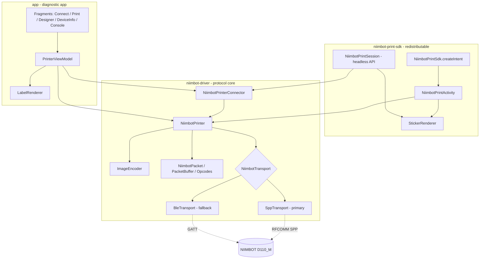
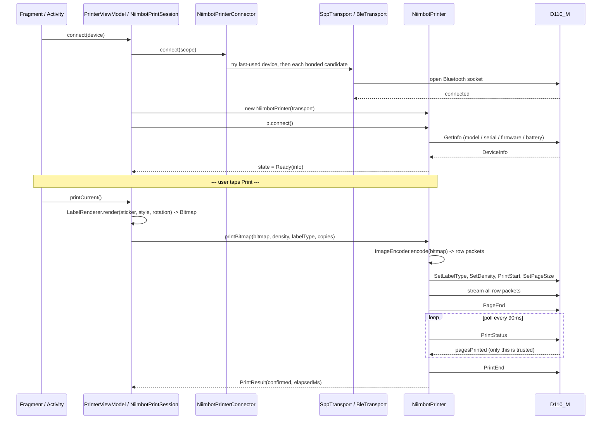
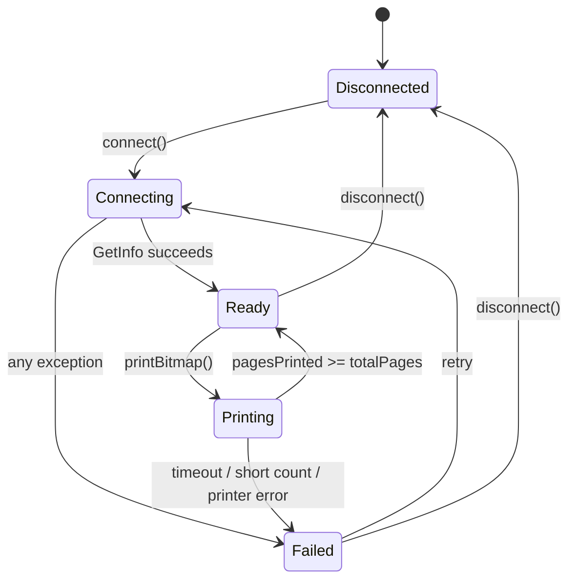

<div align="center">

# NiimBridge

**An Android driver, SDK, and diagnostic app for NIIMBOT thermal label printers, built from scratch because NIIMBOT never gave us one.**

[](LICENSE)


</div>

---

## Table of contents

1. [The story](#the-story)
2. [What's inside](#whats-inside)
3. [How it works](#how-it-works)
4. [Screenshots](#screenshots)
5. [Repository structure](#repository-structure)
6. [Getting started](#getting-started)
7. [Using this in your own app](#using-this-in-your-own-app)
8. [The protocol, in brief](#the-protocol-in-brief)
9. [Lessons learned the hard way](#lessons-learned-the-hard-way)
10. [Testing](#testing)
11. [Roadmap / contributing](#roadmap--contributing)
12. [License](#license)

---

## The story

We run a clinical research study that needed physical specimen labels printed on the spot, in the field, from an Android tablet, for every participant enrolled. After comparing a few options we bought a batch of **NIIMBOT D110_M** thermal sticker printers. They're cheap, small, battery-powered, and print over Bluetooth, which made them a great fit for a mobile study team moving between sites.

There was one problem: **NIIMBOT does not publish an SDK.** No public API, no documentation, nothing you can `implementation()` in a `build.gradle`. Their own consumer app works fine, but it's a closed black box, and it's not something you can embed inside your own study app to drive a custom labeling workflow.

So we did what you do when a vendor won't give you the door: we found another way in.

I captured a Bluetooth HCI snoop log while printing real labels from the official NIIMBOT app to one of our own D110_M units, then sat down with that capture and reverse-engineered the wire protocol frame by frame: the packet format, the checksum, the exact command sequence, the row-encoding scheme, and the one really nasty gotcha (the printer's own progress indicator lies about completion, more on that below). I rebuilt the encoder from scratch and re-ran it against the same capture until the packets it produced were **byte-for-byte identical** to what the official app sent, twice, on two separate print jobs.

That driver became **NiimBridge**: a Kotlin library, a redistributable SDK for other apps on the study to embed, and a full diagnostic app to test, debug, and design labels against real hardware. It's what our field team has been printing specimen stickers with ever since.

There is almost nothing else out there for NIIMBOT + Android that isn't either a locked-down consumer app or an incomplete community script, so we're open-sourcing this in case it saves someone else the same weekend we spent staring at a hex dump.

---

## What's inside

- **A verified Bluetooth protocol implementation** for the NIIMBOT D110_M, reverse-engineered from real captured traffic and validated byte-identical against the official app's output.
- **A standalone driver library** (`niimbot-driver`) with zero UI dependencies: packet framing, checksum, image encoding, connection handling, and the full print state machine.
- **A redistributable SDK** (`niimbot-print-sdk`) so any other Android app can add "print a sticker" in one line, or build a fully custom screen on the same validated primitives.
- **A full diagnostic app** (`app`) with five screens: connect, print, design a label live, view device info/RFID, and a raw packet console for debugging.
- **Two working transports**: Bluetooth Classic SPP (the protocol-verified primary path) and a BLE fallback, both confirmed working against real hardware.
- **Prebuilt release AARs** (`sdk-release/`) ready to drop into another project without pulling in the whole repo.

---

## How it works



The packaged SDK screen and any custom screen built on `NiimbotPrintSession` both call the exact same `NiimbotPrinter` class from the driver module. There's no hidden, more-capable internal path. Everything the packaged screen can do, your own screen can do too.

### Connect -> render -> encode -> print -> confirm



### Connection state machine



Every screen in the app collects the same `StateFlow<PrinterState>` to drive its UI reactively. No polling, no manual refresh needed for connection status.

---

## Screenshots

A real label, printed by this driver, straight off a D110_M during protocol verification:


---

## Repository structure

```
NiimBridge/
├── app/                     Diagnostic/reference Android app (5 screens, full test harness)
├── niimbot-driver/          The protocol driver: framing, encoding, transports, state machine
├── niimbot-print-sdk/       Redistributable SDK for other apps to embed printing
├── sdk-release/             Prebuilt .aar files + integration README for consumer teams
├── docs/
│   └── PROTOCOL.md          The full reverse-engineered protocol spec
└── NiimBRIDGE.md            Deep-dive technical documentation (architecture, code walkthroughs)
```

| Module | Depends on | Purpose |
|---|---|---|
| `niimbot-driver` | nothing but coroutines | Pure protocol library. No UI. This is the actual reverse-engineered driver. |
| `niimbot-print-sdk` | `niimbot-driver` | One-line integration for host apps: a locked-down packaged screen, or a headless session for a custom one. |
| `app` | `niimbot-driver` | The full diagnostic tool: connect, print, design labels live, inspect device/RFID info, watch raw packets. |
| `sdk-release` | (build output) | Prebuilt `.aar`s + a plain-language integration guide, so a consuming team doesn't need this whole repo. |

For a much deeper technical walkthrough (every class, every file, every design decision), see **[NiimBRIDGE.md](NiimBRIDGE.md)**.

---

## Getting started

**Requirements:** Android Studio (current stable), JDK 17, a NIIMBOT D110_M paired to your test device over Bluetooth.

```bash
git clone https://github.com/KunalBhargava182/OpenNiimbot-NiimBridg.git
cd OpenNiimbot-NiimBridg
./gradlew assembleDebug
```

Or just open the folder in Android Studio and hit Run on the `app` module. Pair your D110_M in Android's Bluetooth settings first (this driver requires a bonded device for the primary SPP transport), then use the Connect screen to pick it up.

---

## Using this in your own app

There are two integration paths, depending on how much control you need.

### Packaged (fastest)

Launch a pre-built, locked-down print screen: fixed label template, 1-or-6 copies, done.

```kotlin
val intent = NiimbotPrintSdk.createIntent(context, studyId, emirId)
startActivityForResult(intent, REQUEST_PRINT_STICKER)

// onActivityResult(requestCode, resultCode, data):
if (requestCode == REQUEST_PRINT_STICKER) {
    val message = data?.getStringExtra(NiimbotPrintSdk.EXTRA_RESULT_MESSAGE)
    when (resultCode) {
        Activity.RESULT_OK -> { /* printed successfully */ }
        Activity.RESULT_CANCELED -> { /* user backed out, or it failed - see message */ }
    }
}
```

### Headless (full control)

Build your own screen on the same validated primitives the packaged screen uses:

```kotlin
val session = NiimbotPrintSession(context)
val info = session.connect()
val remaining = session.labelsRemaining()          // check the roll before a batch
val result = session.printLabel(studyId, emirId, copies = 6)
check(result.complete)                              // true only when the printer confirmed every copy
session.disconnect()
```

Both paths call the exact same `NiimbotPrinter` underneath. Pick packaged if the fixed template already fits; pick headless if you need your own layout, branding, or multi-step flow.

---

## The protocol, in brief

The full spec lives in [`docs/PROTOCOL.md`](docs/PROTOCOL.md). The short version:

- **Transport:** Bluetooth Classic SPP over RFCOMM, standard serial port UUID. The printer must already be bonded in Android's Bluetooth settings.
- **Frame format:** `55 55 | type | len | data[len] | checksum | AA AA`, checksum is a running XOR of type, length, and every data byte.
- **Print sequence:** `GetRfid -> Heartbeat -> SetLabelType -> SetDensity -> PrintStart -> SetPageSize -> [row packets] -> PageEnd -> poll PrintStatus -> PrintEnd`.
- **Row encoding:** each row of the label bitmap becomes one of three packet types (blank, indexed pixel positions, or a packed bitmap), with run-length compression across identical rows.

### The one gotcha that matters most

The printer's `PrintStatus` response includes a progress percentage, and it lies. During testing it reported `100/100` progress for seven consecutive polls while the actual page counter sat at zero:

```
pagesPrinted=0  progress=100/100   <- looks done. isn't.
pagesPrinted=0  progress=100/100   <- still isn't.
...  (5 more identical polls)  ...
pagesPrinted=1  totalPages=1       <- NOW it's actually done.
```

**The only trustworthy completion signal is the page counter, `pagesPrinted >= totalPages`.** A poll timeout is always treated as a failure, never an optimistic success. Get this wrong and your app will report "printed!" while a blank label sits in the tray.

---

## Lessons learned the hard way

A running list of things that will silently break printing if you don't know about them:

1. **Bond before connecting.** SPP requires the printer already paired in system Bluetooth settings.
2. **Cancel Bluetooth discovery before opening the RFCOMM socket.** Active discovery cripples the connection.
3. **Reassemble fragmented frames properly.** Packets split across multiple reads; a naive parser that doesn't handle partial frames will hang.
4. **Ignore unsolicited line-progress packets.** The printer sends an unprompted status update mid-stream that must not be matched against a pending request.
5. **Never exceed 96px width.** That's the printhead's hard physical limit.
6. **Never hardcode a printer's MAC address.** A single physical unit exposes two different Bluetooth addresses (one for Classic, one for BLE).
7. **Copies belong in the page-size command, not a separate one.** There is no dedicated "quantity" command on this model.
8. **Trust the page counter, never the progress percentage,** for completion (see above).

---

## Testing

The driver ships with JVM-level tests that need no physical device:

- Packet framing and checksum round-trips
- Frame reassembly across fragmented, byte-at-a-time, and corrupted reads
- **Golden tests against real captured print data**: re-encoded rows are checked byte-for-byte against rows captured from an actual print job
- Full print-sequence ordering, and confirmation that a poll timeout is reported as failure, never success

```bash
./gradlew :niimbot-driver:test
```

---

## Roadmap / contributing

Things that would make this more useful to more people:

- [ ] Support for additional NIIMBOT models beyond the D110_M
- [ ] A Compose-based label designer
- [ ] iOS port of the driver (protocol is platform-agnostic; only the transport layer is Android-specific)

Issues and pull requests are welcome, especially from anyone testing against a different NIIMBOT model. If you get this running on hardware we haven't tested, please open an issue with your findings so the compatibility notes can grow.

---

## License

MIT. See [LICENSE](LICENSE). Use it, fork it, ship it in your own app.
